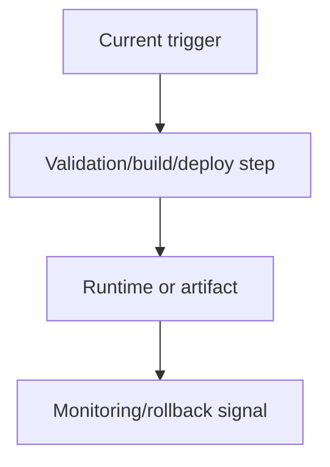

# Implementation Spec Template

Copy this template into the target repo's expected spec location or use it directly in the response. Replace every bracketed prompt with concrete evidence. Delete only sections that are truly not applicable and say why.

## [Title]

Status: Draft | Ready for implementation | Blocked pending root-cause evidence
Date: YYYY-MM-DD
Source: [Linear issue, GitHub issue/PR, CI run, review thread, bug report, security finding, user prompt, audit result]
Related IDs: [Issue IDs, PR numbers, workflow run URL, commit SHA, incident ID]
Target repo/path: [Repo and worktree/path]
Target branch: [Expected branch, if known]
Owner: [Agent/person/team, if known]

## Executive Summary

[Two to five sentences covering: what problem exists, why it matters, why the current implementation is insufficient, and the desired end-state.]

## Root Cause Analysis

Immediate cause:
[Concrete trigger or failure boundary.]

Systemic cause:
[Process, architecture, validation, ownership, tooling, or operational gap that allowed recurrence.]

Architectural contributors:
- [Layering mismatch, missing abstraction, duplicated implementation, weak contract, poor separation of concerns, or "None identified" with evidence.]

Operational/process contributors:
- [Manual step, unclear ownership, release process gap, missing runbook, missing signoff, or "None identified" with evidence.]

Environmental contributors:
- [OS/shell/path/container/runner/hosted-local drift, hidden dependency, missing bootstrap, or "None identified" with evidence.]

CI/CD contributors:
- [Workflow dependency, cache, matrix, action version, trigger, permissions, concurrency, artifact, or "None identified" with evidence.]

Dependency/tooling contributors:
- [Package version, CLI behavior, ecosystem tool mismatch, unsupported platform, or "None identified" with evidence.]

Evidence:
- [Exact failing command, log summary, stack frame, test name, workflow job, security finding, screenshot, trace, or code path.]
- [Where the bad value/state/behavior originates.]
- [Why similar working code behaves differently, if relevant.]

Reproduction or confirmation:
- Command/steps: `[exact command or diagnostic steps]`
- Expected: [Expected result]
- Actual: [Actual result]

## Goal State

Functional goals:
- [Observable behavior or system capability.]

User experience goals:
- [User-visible status, recovery path, retry behavior, empty/error/success
  states, copy, accessibility, or "Not user-facing" with evidence.]

Operational goals:
- [Automation, release, maintenance, ownership, supportability.]

Reliability goals:
- [Failure isolation, retries, deterministic behavior, recovery, flake reduction.]

Debuggability goals:
- [Logs, metrics, traces, correlation IDs, artifacts, runbook updates, or
  clearer error surfaces that make recurrence faster to diagnose.]

Portability goals:
- [Cross-OS, shell, architecture, local/hosted, container, runner, or cloud compatibility.]

Security goals:
- [Secrets, permissions, least privilege, supply chain, data handling, auditability.]

Performance goals:
- [Latency, throughput, cache efficiency, build time, cost, scalability.]

Developer experience goals:
- [Local setup, command clarity, diagnostics, docs, reduced manual work.]

Notification goals:
- [User notification, operator alert, dashboard, issue automation, deployment
  annotation, or "No notification needed" with evidence.]

Success criteria:
- [Measurable outcome 1.]
- [Measurable outcome 2.]
- [Regression guard that must exist after implementation.]
- [Debugging/observability signal that confirms recurrence will be visible.]

## Current State Analysis

Existing architecture:
- [Relevant components, ownership boundaries, data/control flow.]

Existing workflows:
- [Developer, CI, release, deployment, incident, or review workflow.]

Existing deployment/runtime flow:
- [Build, package, release, deploy, runtime bootstrap, secret/config loading.]

Existing automation and validation:
- [Tests, checks, workflows, hooks, smoke tests, monitoring, rollback checks.]

Existing runtime assumptions:
- [Environment variables, OS/shell, services, containers, network, credentials, runner capabilities.]

Existing failure patterns:
- [Recurring failures, flakes, drift, manual recovery, alerts, support issues.]

## Gap Analysis

| Current state | Target state | Gap | Consequence | Required change |
| --- | --- | --- | --- | --- |
| [Current] | [Target] | [Missing infra/automation/validation/standard] | [Impact] | [Concrete change] |

Call out specifically:
- Missing infrastructure:
- Missing validation:
- Missing regression guard:
- Missing automation:
- Duplicated logic:
- Hidden/manual steps:
- Non-portable workflows:
- Missing user recovery or notification:
- Missing observability or operator alerting:
- Missing documentation or ownership:

## Proposed Architecture / Design

Design principles:
- [Reusable workflows/shared abstractions/standardized tooling/idempotent automation/deterministic builds/layered validation/fail-fast behavior/observability/immutable deployment as applicable.]

Data flow:
- [Inputs, transformations, outputs, persistence, contracts.]

Workflow/job dependency flow:
- [Triggers, jobs, dependencies, artifacts, promotions, gates.]

Runtime requirements:
- [Node/Python/Docker/cloud/OS/shell/services/secrets/permissions.]

Tool bootstrap strategy:
- [How tools are installed, pinned, cached, trusted, and verified.]

Cache strategy:
- [Keys, invalidation, scope, restore behavior, local/hosted parity.]

Secret management approach:
- [Where secrets live, access boundaries, rotation, masking, local fallback.]

Rollback strategy:
- [How to revert code, config, workflow, deploy, data, or runner changes.]

Failure recovery strategy:
- [Retries, circuit breakers, alerts, manual recovery runbook, degraded mode.]

Observability:
- [Logs, metrics, traces, dashboard, alert, deployment annotation, audit event.]

Notification and UX recovery:
- [How affected users learn what happened, what action is available, and when
  the system recovers; how operators learn that action is required.]

Diagram, if useful:

## Detailed Implementation Plan

Phase 1: Confirm and isolate
- Scope:
- Expected files/systems:
- Implementation tasks:
- Validation checkpoint:
- Evidence/debugging checkpoint:
- Backward compatibility notes:

Phase 2: Build durable foundation
- Scope:
- Expected files/systems:
- Implementation tasks:
- Validation checkpoint:
- Regression guard checkpoint:
- Migration notes:

Phase 3: Integrate and roll out
- Scope:
- Expected files/systems:
- Implementation tasks:
- Validation checkpoint:
- UX/notification checkpoint:
- Rollout notes:

Phase 4: Cleanup and deprecate
- Scope:
- Expected files/systems:
- Implementation tasks:
- Validation checkpoint:
- Deprecation/removal notes:

Separate deliverables by category:
- Infrastructure changes:
- CI/CD changes:
- Runtime changes:
- Application code changes:
- Validation changes:
- Observability/debugging changes:
- User experience/notification changes:
- Documentation changes:

## Validation Strategy

Unit validation:
- `[exact command/test or required new test]`

Integration validation:
- `[exact command/test or service-level verification]`

E2E validation:
- `[exact command/test or user-flow verification]`

Cross-platform validation:
- [OS/runner/container/browser/device matrix and commands.]

Smoke testing:
- [Post-build/deploy/runtime smoke checks.]

Rollback validation:
- [How rollback will be tested or proven safe.]

Deployment validation:
- [Preview/staging/production checks, health endpoints, release artifacts.]

Monitoring verification:
- [Logs/metrics/alerts/dashboards expected after change.]

Notification verification:
- [User-visible notification/recovery behavior and operator notification or
  alerting path expected after change.]

Failure injection, if appropriate:
- [Simulated failure and expected recovery behavior.]

Hosted validation, if relevant:
- [GitHub Actions checks, deployment jobs, release jobs, security scans expected to pass.]

Manual verification, if unavoidable:
- [Exact manual check and why automation is not practical.]

## Operational Considerations

- Monitoring:
- Alerting:
- Logging:
- User notification and recovery:
- Operator notification and escalation:
- Secrets handling:
- Failure recovery:
- Disaster recovery:
- Scalability:
- Cost impact:
- Maintenance burden:
- Runner/environment drift:
- Dependency lifecycle management:
- Ownership and runbooks:

## Risks, Tradeoffs, And Alternatives

Technical risks:
- Risk: [Specific risk.]
  Mitigation: [How design/validation reduces it.]

Migration risks:
- Risk:
  Mitigation:

Rollout risks:
- Risk:
  Mitigation:

Compatibility risks:
- Risk:
  Mitigation:

Operational risks:
- Risk:
  Mitigation:

Security risks:
- Risk:
  Mitigation:

Cost and complexity tradeoffs:
- [What becomes more expensive or complex, and why it is acceptable.]

Rejected alternatives:
- Alternative: [Option]
  Rejected because: [Concrete reason.]

## Dependencies

- Internal dependencies:
- External services/platforms:
- Tooling/package dependencies:
- Secret/config dependencies:
- People/team approvals:
- Documentation/runbook dependencies:

## Rollout And Migration Plan

1. [Pre-work and compatibility guard.]
2. [Incremental rollout step.]
3. [Validation gate before promotion.]
4. [Production or final enablement.]
5. [Cleanup/deprecation.]

Rollback plan:
- [Exact rollback trigger, owner, command/process, and expected validation.]

## Deliverables

Concrete deliverables:
- [Deliverable 1.]
- [Deliverable 2.]

Expected repository/file changes:
- `[path or glob]` - [Expected purpose.]

Workflow additions/removals:
- [Workflow/job/action/script changes.]

Infrastructure additions/removals:
- [Resources, config, IaC, runners, services.]

New automation requirements:
- [Scheduled jobs, checks, scripts, bots, release gates.]

Validation requirements:
- [Commands/checks/artifacts required before done.]

Acceptance criteria:
- [Observable criterion.]
- [Test/validation criterion.]
- [Documentation/operational criterion.]
- [No known regression criterion.]

## Open Questions

- [Question or decision still needed. Use "None" only when true.]

## Autonomous Agent Handoff Prompt

Use this implementation spec to execute the work in [repo/path]. Start by reading the required repo instructions and verifying the current state. Reproduce or confirm the evidence above before editing. Implement only the scoped phases, keep changes independently testable, add the specified regression coverage, update required docs/runbooks, run the validation strategy, and report blockers with exact failing commands and evidence. Do not bypass hooks, overwrite unrelated changes, assume undocumented environment behavior, or expand scope without approval.
